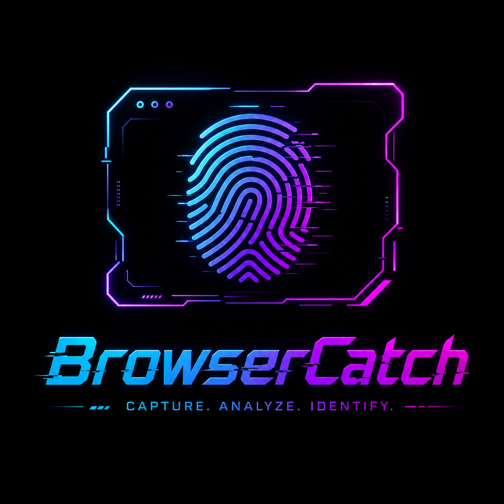

<p align="center">
  
</p>

# Browser Fingerprint Collector

`browsercatch.py` is a lightweight collaborator-style inbound listener for authorized red-team and pentest workflows.

It gives you a local, scriptable callback endpoint that captures inbound HTTP beacons, enriches them with useful fingerprint data, and writes results in formats that are easy to inspect manually or feed into automation.

## At A Glance

- Tokenized callback paths for blind interaction tracking
- Support for `GET`, `POST`, `PUT`, `PATCH`, `DELETE`, `OPTIONS`, and `HEAD`
- Structured outputs for terminals, files, and machines
- Built-in browser collector page for richer fingerprint capture
- Fast lifecycle endpoints for health checks and polling-based tooling
- Designed for reversible, local-first operator workflows

## What It Is Good For

- Blind callback detection during web, API, and SSRF testing
- Verifying whether a payload or lure actually reached a target browser or server
- Collecting browser and environment hints from interactive visits
- Replacing external collaborator services with a local listener you control
- Producing clean evidence for later triage, reporting, or chaining

## Core Capabilities

### Inbound Capture

- Tokenized callback routes at `/c/<token>` by default
- Multi-method request logging
- Query string, headers, and body capture
- Optional request size limits for safe collection

### Browser Fingerprinting

- User-Agent parsing
- Browser and OS hints
- Client hint enrichment
- Screen, viewport, and device metrics
- Timezone, language, touch, plugins, WebGL, canvas, storage, and media preference signals when available

### Operator Outputs

- JSONL stream for automation
- Per-event JSON files for file watchers
- `latest.json` for polling
- `summary.json` for run stats and hint counters
- Markdown run log for compact human review
- Live terminal reporting for active operator use

### Built-In Endpoints

- `/health` for liveness
- `/events` for recent events
- `/latest` for the latest event snapshot
- `/summary` for run metadata and counters
- `/static/*` when a static directory is configured

## Quick Start

```bash
cd Browser-Fingerprint-Collector
python3 browsercatch.py --port 8080
```

The listener prints a callback URL similar to:

```text
http://127.0.0.1:8080/c/<token>
```

Open `http://127.0.0.1:8080/` in a browser to load the built-in collector page and send a richer beacon to the tokenized callback URL.

## CLI

```bash
python3 browsercatch.py [flags]
```

### Common Flags

- `--host 0.0.0.0` bind address
- `--port 8080` listener port
- `--token abc123` fixed callback token
- `--token-length 14` random token length
- `--base-path /c` callback path prefix
- `--public-url https://your-domain.tld` external base URL for printed callback links
- `--serve-file index.html` serve a custom HTML lure at `/`
- `--static-dir .` expose files under `/static/*`
- `--results-dir results` output directory
- `--log-jsonl results/events.jsonl` JSONL event log path
- `--log-markdown results/Results-browsercatch.md` Markdown run log path
- `--event-files-dir results/events` per-event JSON directory
- `--latest-json results/latest.json` latest event snapshot path
- `--summary-json results/summary.json` run summary path
- `--max-body 65536` max request body bytes to read per event
- `--stdout-json` emit concise JSON event lines to stdout
- `--live` or `--active` render structured live terminal reports
- `--quiet` reduce default server output
- `--once` stop after the first captured event

## Output Model

Every captured event can be written to multiple surfaces at once:

- `results/events.jsonl` for append-only event streaming
- `results/events/event-*.json` for per-event artifacts
- `results/latest.json` for the most recent event snapshot
- `results/summary.json` for totals, unique IPs, path counts, and hint counters
- `results/Results-browsercatch.md` for compact operator notes and history

This makes the tool useful both as an interactive listener and as a backend for other automation.

## Example Runs

### Basic Listener

```bash
python3 browsercatch.py --port 8080
```

### One-Shot Lure

Serve a custom lure and stop after the first callback:

```bash
python3 browsercatch.py \
  --port 8080 \
  --serve-file index-interactwebhook.html \
  --once
```

### Machine-Friendly JSON

```bash
python3 browsercatch.py --port 8080 --stdout-json --quiet
```

### Live Operator View

```bash
python3 browsercatch.py --port 8080 --live
```

### Force All Outputs Into `./results`

```bash
python3 browsercatch.py \
  --port 8080 \
  --results-dir results \
  --stdout-json
```

### Public Callback URL

```bash
python3 browsercatch.py \
  --host 0.0.0.0 \
  --port 8080 \
  --public-url https://collab.example.com
```

## HTML Placeholders

When you use `--serve-file`, the following placeholders are replaced automatically:

- `__CALLBACK_URL__`
- `__TOKEN__`
- `__LISTENER_HOST__`
- `__LISTENER_PORT__`

That lets you keep lure templates static while still injecting the live listener details at runtime.

## Operator Notes

- Use only on authorized targets and scopes.
- Make sure the listener is reachable from the target network path.
- If you are testing through NAT, firewall, or DNS, validate reachability before assuming a payload failed.
- Keep the callback URL stable when you need repeatable evidence.

## Project Files

- `browsercatch.py` main listener and event pipeline
- `index.html` built-in browser collector page
- `index-interactwebhook.html` sample lure template
- `index-teams.html` alternate template
- `logo.png` project branding
